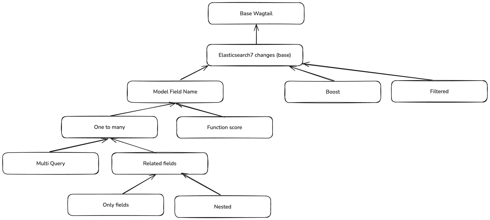

# Wagtail Extended Search

Improve the default Wagtail search behaviour by adding support for more complex indexing and querying.
This work is heavily based on the [extended_search](https://github.com/uktrade/digital-workspace-v2/tree/2cecde1de6c790b0176ef79cab76f88d173cf244/src/extended_search) application from the [uktrade/digital-workspace-v2](https://github.com/uktrade/digital-workspace-v2/) project.

## Installation

Add with your package manager of choice:
`pip install wagtail-extended-search`

Add to your installed apps:
```python
INSTALLED_APPS = [
    ...
    'wagtail_extended_search',
    ...
]
```

Set the search backend to `wagtail_extended_search.backends.backend.CustomSearchBackend` in your settings:
```python
WAGTAILSEARCH_BACKENDS = {
    'default': {
        'BACKEND': 'wagtail_extended_search.backends.backend.CustomSearchBackend',
    },
}
```

## Search changes

The search behaviour we are aiming for with this package is based on the [How GitHub Docs' new search works](https://github.blog/engineering/how-github-docs-new-search-works/) blog.

Some of the changes in this package are only compatible with an ElasticSearch backend, while others should be cross-compatible.

### Indexing

The default Wagtail search allows for indexing fields in a 1-to-1 manner.

This package expands the Wagtail behaviour to allow a field to be indexed in a 1-to-many manner. This unlocks the ability to index a field in different ways so that you can build more complex behaviours.

### Querying

The default Wagtail search behaviour works for ElasticSearch uses some really simple logic. For each indexable model, indexable page content is concatenated into a single `_all_text` field. Then the search query does a simple search against that indexed field.

This package brings a custom query builder object that looks over the indexed models and builds a query for the relevant models so that we can have a more targeted search.

### Layers

<!-- Include a PNG -->



#### Base

`wagtail_extended_search.layers.base`

There's a lot of overriding of the base Wagtail Elasticsearch7 search backend functionality.
TODO: Summarise the changes

#### Model Field Name

`wagtail_extended_search.layers.model_field_name`

Extends the Wagtail base functionality to add the ability for the search fields to have a name that refers to it's name in the search index, and then a `model_field_name` that refers to the name of the field on the model.

> **Dev Note:**
>
> This feels like it is closely related to the "One-to-Many" layer.

#### One-to-Many

`wagtail_extended_search.layers.one_to_many`

Adds the `IndexField` concept which holds the config and logic for indexing a single model field into many search index fields.

#### Multi Query

`wagtail_extended_search.layers.multi_query`

Extends the `IndexField` concept with the ability to configure analysers, tokenized fields, etc.

#### Related Fields

`wagtail_extended_search.layers.related_fields`

Extends the `IndexField` concept so that we can configure related fields in a similar one-to-many manner. It also fixes the indexing of related fields so that the indexed document contains a nested structure.

> **Dev Note:**
>
> This feels like it is closely related to the "nested" layer.

#### Boost

`wagtail_extended_search.layers.boost`

Fixes the Elastic search backend to respect the boosts that have been set on the `Indexed.search_fields` list of `SearchField` objects.

#### Filtered

`wagtail_extended_search.layers.filtered`

Adds the ability to only run a query against a subset of the index. For example, only running the query against News Pages instead of all Pages.

#### Function Score

`wagtail_extended_search.layers.function_score`

Adds the ability to apply a function to the score of a query. (Currently only supports OpenSearch/Elastic Search functions)

**Helpful links:**
- [OpenSearch: Function score](https://opensearch.org/docs/latest/query-dsl/compound/function-score/)

#### Nested

`wagtail_extended_search.layers.nested`

Adds the ability to query an index that references nested fields.

**Helpful links:**
- [OpenSearch: Nested fields](https://opensearch.org/docs/latest/field-types/supported-field-types/nested/)
- [OpenSearch: Nested query](https://opensearch.org/docs/latest/query-dsl/joining/nested/)

#### Only Fields

`wagtail_extended_search.layers.only_fields`

Adds the ability to restrict a search query so that it only applies to a given set of fields.

## Running local development

We use the [Wagtail Bakery Demo](https://github.com/wagtail/bakerydemo) as a base Wagtail project to run the package locally for testing purposes.

### Set up

These commands can be used to get set up:

```bash
# Build and initialise the docker containers
make bakery-init
```

The bakery demo should now be running at [http://localhost:8000](http://localhost:8000).

### Updating/Resetting

To update the bakery demo to the latest version, you can down the containers and rebuild them:

```bash
make bakery-refresh
```
